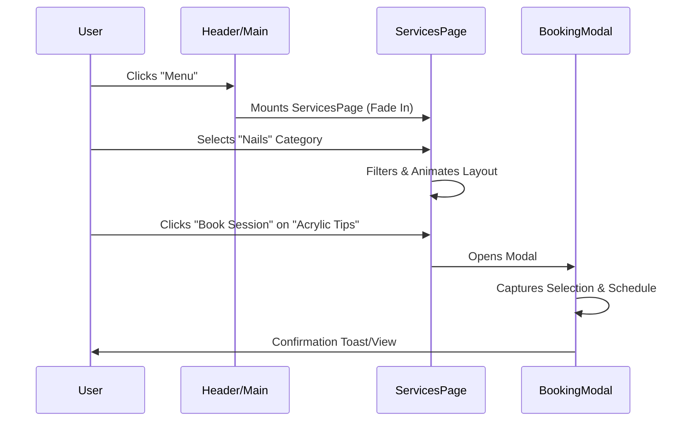
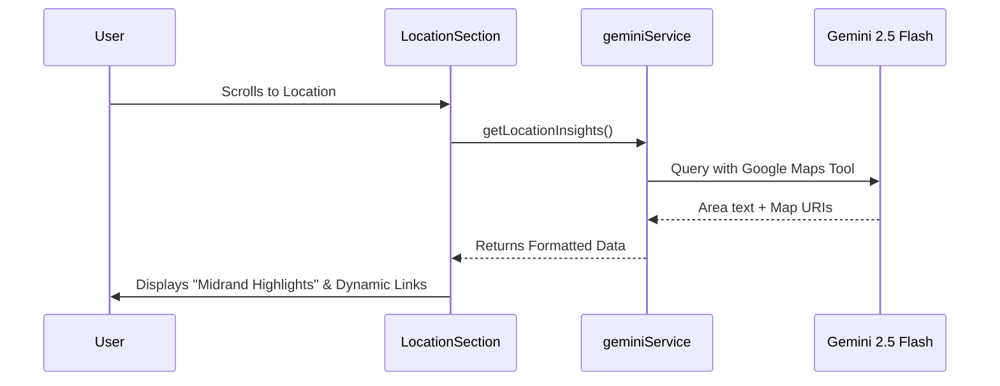

# 🌸 TA's Beauty Lounge | Site Flow Documentation

This document outlines the operational flow, user journeys, and data processing sequences of the TA's Beauty Lounge web application.

---

## 🗺️ User Journey Mapping

### 1. The Discovery Journey (Landing & Home)
*   **Entry Point**: User arrives at the **Hero Section**. High-impact visuals establish the "Midrand Elite" brand identity.
*   **Contextual Discovery**: User scrolls to **About**, learning about the sanctuary's philosophy and meeting the lead technician, **Portia**.
*   **Social Validation**: User scrolls past the **Social Feed** and **Testimonials**, viewing real-world results and community engagement to build trust.
*   **Call to Action**: Direct "Book Now" buttons are distributed at key emotional high points (Hero, Featured Services, and the Final CTA section).

### 2. The Intelligent Discovery (AI Consultation)
*   **Engagement**: User finds the **Virtual Beauty Advisor** section.
*   **Input**: User selects a skin type and types a specific concern (e.g., "dry skin after winter").
*   **Processing**: The application initiates an asynchronous call to the `geminiService`.
*   **Manifestation**: The UI transitions from a "waiting" state to a "results" state, displaying three bespoke recommendations with clear "Benefits" tags.

### 3. The Conversion Journey (Booking)
*   **Selection**: User triggers the **Booking Modal** from any view.
*   **Step 1 (The Choice)**: User browses a simplified list of treatments. Selecting one automatically progresses the UI.
*   **Step 2 (The Time)**: User selects a date (via date picker) and a time slot (via grid). The logic ensures that all required scheduling data is captured.
*   **Step 3 (The Person)**: User enters personal contact details.
*   **Completion**: Upon clicking "Confirm", the modal provides a final visual confirmation and allows the user to return to browsing.

---

## 🔄 Technical Data Flow

### Navigation State Logic
The application manages its flow via a central `currentView` state in `App.tsx`:
1.  **Home View**: Sections are reached via **Anchor Links** (#about, #location) which use smooth-scroll behavior.
2.  **Menu View**: Triggered by the "Menu" link in the header or "Explore Menu" buttons. This replaces the Home view with the `ServicesPage` component using `AnimatePresence` for a seamless fade transition.

### Sequence Diagram: Service Selection & Booking

### Sequence Diagram: AI Location Insights

---

## 🛠️ Global UI Persistence
*   **Header**: Persists across all views. It dynamically changes transparency based on scroll depth or view state (Solid White for Services, Transparent for Home Hero).
*   **Footer**: Persists as the final touchpoint, providing constant access to contact details and opening hours (Mon-Sat: 08:30 - 18:00, Sun: 09:00 - 14:00).
*   **Modal Overlay**: The Booking system uses a global portal-like strategy to ensure it remains above all navigation and content, preventing flow interruption.
